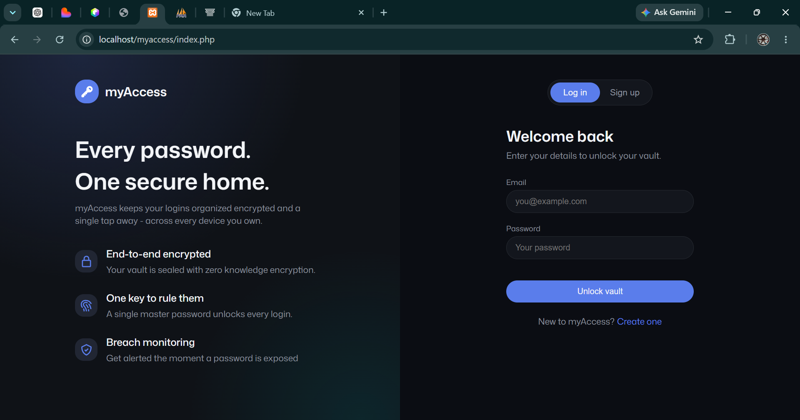
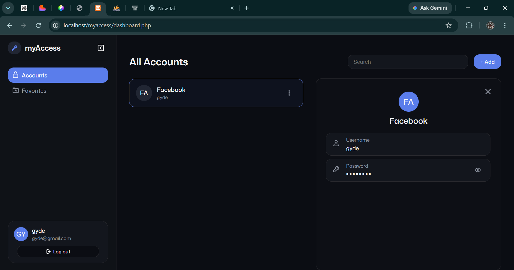
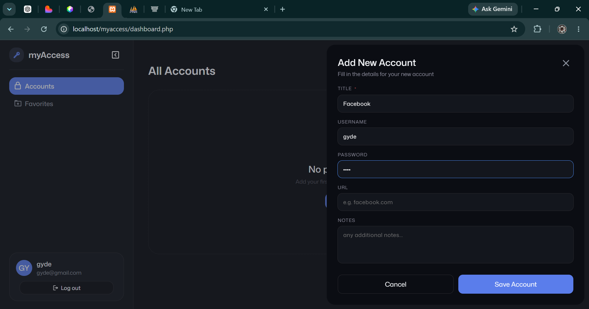

# myAccess

A simple password manager to store and manage your online account credentials.

### Login

### Accounts Dashboard

### Add Account Panel

## Features

- User login and sign up
- View all saved accounts in one place
- Add new accounts instantly
- Delete accounts
- Favorites section *(in progress)*
- Edit account *(in progress)*

## Tech Stack

- HTML, CSS, JavaScript
- PHP
- MySQL (XAMPP)

## Status

This project is actively being developed. Some features are still in progress.

## About

This project was built from scratch as a way to learn web development —
HTML, CSS, JavaScript, PHP, and working with databases.

---

GitHub: [liljaydi](https://github.com/liljaydi)